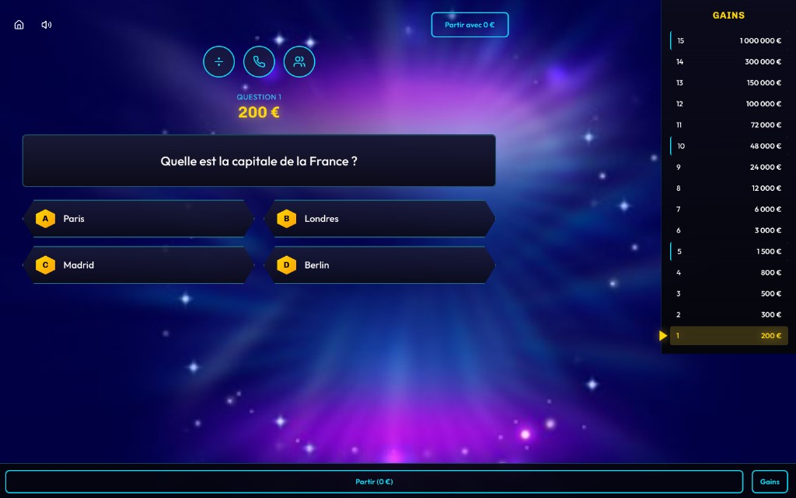

# QVGDM — Qui veut gagner des millions ?

Application web de quiz inspirée du jeu télévisé **Qui veut gagner des millions ?**. Vous préparez **15 questions** à quatre réponses, puis vous montez les **15 paliers** jusqu’au gain maximal — en solo ou à deux en local.

Projet **ludique et non officiel**, pensé pour les soirées entre amis, en famille ou en classe.

---

## Sommaire

- [Aperçu de l’interface](#aperçu-de-linterface)
- [Fonctionnalités](#fonctionnalités)
- [Règles et paliers](#règles-et-paliers)
- [Parcours habituel](#parcours-habituel)
- [Prérequis](#prérequis)
- [Installation et lancement (frontend)](#installation-et-lancement-frontend)
- [Scripts npm / yarn](#scripts-npm--yarn)
- [Application progressive (PWA)](#application-progressive-pwa)
- [Backend optionnel (FastAPI)](#backend-optionnel-fastapi)
- [Technologies](#technologies)
- [Structure du dépôt](#structure-du-dépôt)

---

## Aperçu de l’interface

En partie, l’écran est organisé ainsi :

- **En-tête** : retour et volume à gauche ; au centre, les **trois jokers** (50:50, appel à un ami, avis du public) ; à droite, **partir avec les gains** affichés.
- **Zone centrale** : **QUESTION n** et **montant du palier** au-dessus du libellé ; en dessous, les **quatre réponses** en grille 2×2 (A à D).
- **Colonne « Gains »** : pyramide des **15 niveaux** ; le palier courant est mis en évidence ; **seuils de sécurité** repérés sur la liste.
- **Pied de page** : raccourcis selon la taille d’écran (quitter, pyramide, etc.).

**Exemple d’écran de jeu :**



---

## Fonctionnalités

| Domaine | Détail |
|--------|--------|
| **Modes** | Solo ou **multijoueur local** (2 joueurs, tours alternés) |
| **Questions** | 15 questions, 4 propositions (A–D), une bonne réponse par question |
| **Bibliothèque de thèmes** | Thèmes prédéfinis (culture, sport, cinéma, etc.), chacun avec 15 questions du plus facile au plus difficile ; possibilité de **créer des thèmes personnalisés** (stockage **local** dans le navigateur) |
| **Ordre des questions** | Option pour **mélanger** l’ordre des 15 questions (Fisher-Yates) ; les montants des paliers restent alignés sur la progression (1 → 15) |
| **Jokers** | 50:50, téléphone (conseil simulé), avis du public (pourcentages) — **une utilisation chacun** par partie |
| **Timer** | Optionnel, durée configurable (**10 à 120** secondes, défaut 30) ; le temps peut se mettre en pause lors de certains écrans (jokers, validation) |
| **Données** | **Import** et **export** des quiz en **JSON** (métadonnées + réglages utiles au partage) |
| **Ambiance** | Sons par événement (suspense, bonne/mauvaise réponse, palier, million, etc.), interface sombre type plateau TV |
| **PWA** | Installable sur l’écran d’accueil ; cache hors ligne (shell + médias) ; bannière de mise à jour quand une nouvelle version est déployée |

---

## Règles et paliers

- Une **mauvaise réponse** termine la manche. Le gain retenu est celui du **dernier palier de sécurité** déjà **validé** en répondant correctement à la question correspondante — sinon **0 €**.
- Vous pouvez **vous arrêter** à tout moment et repartir avec le montant affiché pour la dernière question **déjà validée**.
- En mode **chrono**, si le temps est écoulé avant validation, la réponse est traitée comme une erreur ; le gain suit la même logique de **paliers de sécurité**.

**Montants des 15 paliers** (tels qu’implémentés dans l’app) :

| # | Montant | Seuil de sécurité |
|---|---------|-------------------|
| 1 | 200 € | — |
| 2 | 300 € | — |
| 3 | 500 € | — |
| 4 | 800 € | — |
| 5 | 1 500 € | Oui |
| 6 | 3 000 € | — |
| 7 | 6 000 € | — |
| 8 | 12 000 € | — |
| 9 | 24 000 € | — |
| 10 | 48 000 € | Oui |
| 11 | 72 000 € | — |
| 12 | 100 000 € | — |
| 13 | 150 000 € | — |
| 14 | 300 000 € | — |
| 15 | 1 000 000 € | Oui (sommet) |

---

## Parcours habituel

1. **Accueil** — Choisir solo ou multijoueur et saisir les prénoms si besoin.
2. **Création du quiz *(optionnel)*** — Rédiger les 15 questions, cocher la bonne réponse, naviguer entre les questions **OU** choisir un **thème** prédéfini ou **importer** un JSON ; régler **timer**, **mélange**, etc.
3. **Partie** — Lancer le jeu, utiliser les jokers, confirmer avec « C’est mon dernier mot ! », suivre la pyramide ; **exporter** le quiz pour le réutiliser plus tard.

---

## Prérequis

- **Node.js** récent (compatible avec **React 19** et Create React App via Craco ; en pratique, une **LTS** courante type 18.x ou 20.x est appropriée).
- Un navigateur à jour.

---

## Installation et lancement (frontend)

Le jeu tourne entièrement dans le navigateur ; **aucun serveur n’est obligatoire** pour jouer.

```bash
cd frontend
npm install
npm start
```

Le dépôt déclare aussi **Yarn 1** comme gestionnaire de paquets (`packageManager` dans `package.json`) ; vous pouvez utiliser à la place :

```bash
cd frontend
yarn install
yarn start
```

L’URL locale est en général **http://localhost:3000** (voir la sortie du terminal).

---

## Scripts npm / yarn

| Commande | Rôle |
|----------|------|
| `npm start` / `yarn start` | Serveur de développement (Craco) |
| `npm run build` / `yarn build` | Build de production dans `frontend/build` |
| `npm test` / `yarn test` | Tests interactifs (CRA / Craco) |

---

## Application progressive (PWA)

En **build de production**, l’app s’enregistre comme **Progressive Web App** :

- **Manifeste** (`frontend/public/manifest.json`) : nom, icônes 192/512 (dont maskable), thème sombre, affichage `standalone`.
- **Service worker** (Workbox via CRA) : precache du shell ; navigation SPA ; cache des images ; **sons et visuels lourds** (MP3, JPEG, WebP) mis en cache **à la demande** pour ne pas gonfler le premier chargement.
- **Mises à jour** : lorsqu’une nouvelle version est disponible, une bannière propose **Mettre à jour** ; l’app recharge ensuite avec le nouveau service worker.

Le service worker n’est **pas** actif en `npm start` (mode développement). Pour tester la PWA en local :

```bash
cd frontend
npm run build
npx serve -s build
```

Ouvrez l’URL du jeu, puis utilisez **Installer l’application** ou **Ajouter à l’écran d’accueil** selon le navigateur. 
Les quiz et thèmes personnalisés restent dans le **stockage local** du navigateur ; le cache PWA concerne surtout les fichiers statiques et les médias.

## Technologies

- **Frontend** : React 19, React Router 7, **Tailwind CSS** 3, **Framer Motion**, **Craco** au-dessus de Create React App, Radix UI (switch), Lucide (icônes), **Workbox** (PWA).
- **Données de jeu** : état et quiz gérés **côté client** (`localStorage` pour les thèmes, `sessionStorage` pour la session de partie, import/export JSON).

---

## Structure du dépôt

```
QVGDM/
├── frontend/              # Application React + PWA
│   ├── public/            # manifest.json, icônes, index.html
├── backend/               # API FastAPI + MongoDB (optionnelle)
├── docs/screenshots/      # Captures pour la documentation
└── memory/PRD.md          # Notes produit / historique de fonctionnalités
```

---

## Légal / mention

Ce dépôt est un **hommage** au format télévisé ; il n’est **pas** affilié aux ayants droit de l’émission originale.
